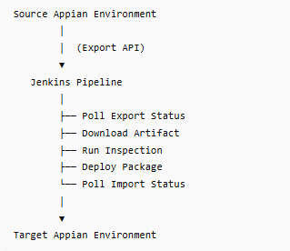

# 🚀 Appian CI/CD Pipeline Automation
The pipeline automates application migration between Appian environments by replacing manual export/import activities with a standardized and auditable deployment workflow.
This project demonstrates an automated CI/CD deployment pipeline for the NeuraDev Appian application using Jenkins and the Appian Deployment Management API v2.

# Objectives
Automate Appian package export and import
Reduce manual deployment effort
Ensure deployment consistency across environments
Perform automated inspection and validation before deployment
Monitor deployment status through Jenkins orchestration
Improve deployment traceability and reliability
## Architecture

  
  &nbsp;
  

## Technologies Used
| Technology                          | Purpose               |
| ----------------------------------- | --------------------- |
| Jenkins                             | CI/CD Orchestration   |
| Appian Deployment Management API v2 | Deployment Automation |
| REST APIs                           | Communication Layer   |
| Curl                                | API Requests          |
| JSON                                | API Payloads          |
| Shell Scripting                     | Pipeline Automation   |

## Pipeline Workflow
### Stage 1 — Export Application

Initiates package generation from the source environment using: `POST /suite/deployment-management/v2/deployments`
Header used: `Action-Type: export`

### Stage 2 — Poll Export Status
The pipeline continuously checks export progress every 10 seconds until the deployment status becomes: `COMPLETED`

### Stage 3 — Download Package
After export completion:

1. Retrieve packageZip URL
2. Download deployment artifact (artifact.zip)
3. Store artifact in Jenkins workspace

### Stage 4 — Inspect Package

The package is validated against the target environment before deployment using: `POST /suite/deployment-management/v2/inspections`
Inspection validates:

1. Missing dependencies
2. Object compatibility
3. Environment readiness

### Stage 5 — Deploy Package

If inspection passes, the package is deployed using: `POST /suite/deployment-management/v2/deployments`
Header used: `Action-Type: import`

### Stage 6 — Poll Import Status

The pipeline monitors deployment progress until one of the following statuses is returned:
1. COMPLETED
2. FAILED
3. COMPLETED_WITH_IMPORT_ERRORS

## Sample Curl Commands
### Export Deployment
`curl --request POST \
--url https://<appian-url>/suite/deployment-management/v2/deployments \
--header 'Action-Type: export'`

### Import Deployment
`curl --request POST \
--url https://<appian-url>/suite/deployment-management/v2/deployments \
--header 'Action-Type: import'`

